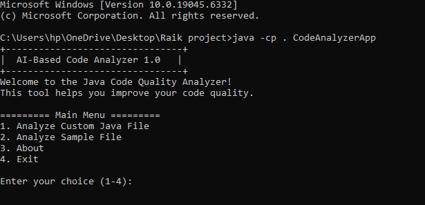
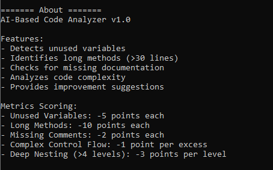
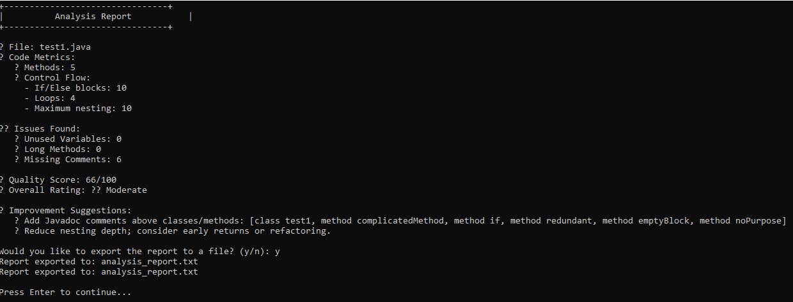
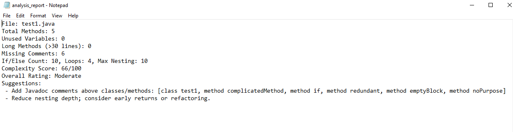
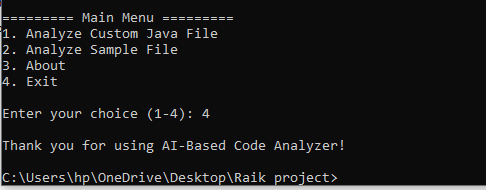

---

# ⚡ AI-Based Code Analyzer

<p align="center">
  <a href="https://www.java.com/">
    
  </a>
  <a href="https://opensource.org/licenses/MIT">
    
  </a>
  
  
</p>

> A **Java-based intelligent analyzer** that scans and evaluates Java source code for quality metrics, detects potential issues, and provides **smart improvement suggestions**.

---

## 🚀 Features

* 🔍 **Automatic Code Scanning** — Detects potential code issues instantly
* 🧹 **Unused Variable Detection** — Keeps your code clean
* 📏 **Long Method Identification** — Highlights methods exceeding 30 lines
* 🗒️ **Comment Checking** — Encourages better documentation habits
* 🧠 **Code Complexity Evaluation** — Measures control depth & logic flow
* 📊 **Quality Scoring System** — Generates an overall project health score
* 📝 **Report Export** — Save detailed results in `.txt` format

---

## 🛠️ Requirements

* ☕ **Java JDK 8+**
* 💻 **Command-line / Terminal access**

---

## ⚙️ How to Run

### 🧩 Step 1 — Compile the Source Files

#### 🪟 For Windows (PowerShell)

```powershell
cd "C:\path\to\AI_Code_Analyzer"
javac -encoding UTF-8 *.java sample/*.java
```

#### 🐧 For Linux / Mac

```bash
cd /path/to/AI_Code_Analyzer
javac -encoding UTF-8 *.java sample/*.java
```

---

### 🚀 Step 2 — Run the Analyzer

#### ➤ Analyze a Single File

```bash
java -cp . CodeAnalyzerApp sample/SampleClass.java
```

#### ➤ Analyze a Folder

```bash
java -cp . CodeAnalyzerApp sample/
```

#### ➤ Export Results to Report

```bash
java -cp . CodeAnalyzerApp sample/SampleClass.java > reports/output.txt
```

💡 *Tip:* Always compile with `-encoding UTF-8` to avoid character issues.

---

## 🎥 Demo Video

Watch the working demo here 👇
🎬 [Click to Watch on Google Drive](https://drive.google.com/file/d/1Pli6mMXCu0Td5tvw8nnJYSSxrtEXM6xv/view?usp=drivesdk)

---

## 🖼️ Screenshots

<p align="center">
  <br>
  <br>
  <br>
  <br>
  
</p>

---

## 🧩 Project Structure

| File                   | Description                        |
| ---------------------- | ---------------------------------- |
| `CodeAnalyzerApp.java` | Main application entry point       |
| `Parser.java`          | Handles file reading and parsing   |
| `Analyzer.java`        | Performs code analysis and scoring |
| `Reporter.java`        | Generates reports                  |
| `sample/`              | Sample Java files for testing      |

---

## 📈 Sample Output

```
File: SampleClass.java
Total Methods: 3
Unused Variables: 2
Long Methods (>30 lines): 1
Missing Comments: 2
Complexity Score: 68/100
Overall Rating: Moderate
```

---

## 📊 Code Quality Metrics

| Metric                           | Penalty          |
| -------------------------------- | ---------------- |
| 🧩 **Unused Variables**          | −5 pts each      |
| 📏 **Long Methods**              | −10 pts each     |
| 🗒️ **Missing Comments**         | −2 pts each      |
| ⚙️ **Complexity Structures**     | −1 pt each       |
| 🕳️ **Deep Nesting (>4 levels)** | −3 pts per level |

---

## 👩‍🎓 Author

**Mahak Singla**
📧 [minkisingla29@gmail.com](mailto:minkisingla29@gmail.com)

---

## ⭐ Contribute

Pull requests are welcome!
If you find a **bug 🐛** or have an **idea 💡**, feel free to **open an issue** or **submit a PR**.

Let’s make Java code smarter together 💪

---

